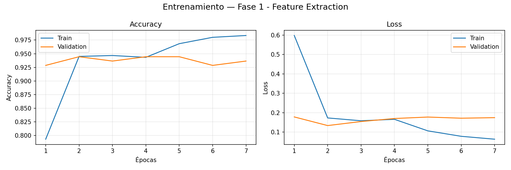

# S-Can — Dog Breed Recognition with AI

> Identify your dog's breed in seconds using Transfer Learning with MobileNetV2

[](docs/AI_PIPELINE.md)
[](https://www.python.org/)
[](https://nodejs.org/)
[](https://tensorflow.org/)
[](https://fastapi.tiangolo.com/)
[](LICENSE)

---

## What is S-Can?

S-Can is a full-stack web application that analyzes a dog photo and returns:

- **Detected breed** — title-cased, human-readable name
- **Confidence score** — model certainty as a percentage
- **Care guide** — exercise level, grooming needs, and temperament

The system is powered by a custom-trained MobileNetV2 model achieving **94% accuracy** on 5 dog breeds, served through a FastAPI microservice and consumed by a Node.js/Express backend.

---

## Screenshots

| Upload & Analyze | Detection Result | History |
|:---:|:---:|:---:|
|  |  |  |

> Screenshots will be added after first deployment. See [DEPLOYMENT.md](docs/DEPLOYMENT.md) to run locally.

---

## Tech Stack

| Layer | Technology | Purpose |
|---|---|---|
| **Frontend** | HTML5 + CSS3 + JavaScript Vanilla | SPA without frameworks |
| **Backend API** | Node.js 20 + Express 4 | REST API, file handling, JSON transformation |
| **File Upload** | Multer | Multipart validation, 5 MB limit |
| **HTTP Client** | Axios + form-data | Node.js → Python communication |
| **Inference Server** | FastAPI + Uvicorn | Python ML microservice |
| **ML Model** | TensorFlow/Keras 2.13 | Training and inference |
| **Base Architecture** | MobileNetV2 (ImageNet) | Transfer Learning backbone |
| **Image Processing** | Pillow + NumPy | Preprocessing pipeline |
| **Metrics** | scikit-learn | Classification report |
| **Fonts** | Syne + Outfit (Google Fonts) | Display and body typography |

---

## AI Pipeline

```
User uploads photo
      │
      ▼
Node.js (Express + Multer)
  validates type & size → saves to disk
      │
      ▼  HTTP POST multipart
FastAPI (predict.py)
  Pillow: open → RGB → 224×224 (LANCZOS) → float32/255 → batch dim
  MobileNetV2 → Dense(128) → Dropout(0.3) → Dense(5, softmax)
  argmax → class_indices.json → breed name
      │
      ▼  { breed: "golden_retriever", confidence: 0.9134 }
Node.js (aiService.js)
  snake_case → "Golden Retriever"
  0.9134 → "91%"
  findCare() → breeds.js catalog
      │
      ▼
Frontend renders result card
  + saves to localStorage history & stats
```

### Model Performance

Evaluated on **134 held-out test images** (15% of the dataset, never seen during training):

| Breed | Precision | Recall | F1 | Support |
|---|---|---|---|---|
| Beagle | 0.94 | 0.97 | 0.95 | 30 |
| Chihuahua | 0.95 | 0.88 | 0.91 | 24 |
| Golden Retriever | 0.96 | 0.96 | 0.96 | 23 |
| Husky Siberiano | 0.94 | 0.97 | 0.95 | 30 |
| Labrador Retriever | 0.93 | 0.93 | 0.93 | 27 |
| **Overall Accuracy** | | | **0.94** | **134** |

Training loss: `0.1621` — Test accuracy: **94.03%**

Training curves:



### Training Strategy — Two-Phase Transfer Learning

**Phase 1 — Feature Extraction** (MobileNetV2 frozen):
- Trains only the classification head (164K params out of 2.4M)
- Adam lr=1e-3, up to 20 epochs, EarlyStopping patience=5

**Phase 2 — Fine-Tuning** (top layers unfrozen):
- Unfreezes MobileNetV2 from layer index 100+
- Adam lr=1e-5 (100× smaller to preserve pretrained weights)
- Only runs if Phase 1 reaches val_accuracy ≥ 60%

---

## Quick Start

### Prerequisites

```bash
node --version   # >= 18
python3 --version  # >= 3.10
```

### 1. Install backend dependencies

```bash
cd backend
npm install
```

### 2. Set up Python environment

```bash
cd ai
python3 -m venv venv
source venv/bin/activate
pip install -r requirements.txt
```

### 3. Train the model (or use pre-trained weights)

```bash
# Prepare and split dataset (requires images in ai/dataset/raw/<breed>/)
python3 prepare_dataset.py

# Train (Phase 1 + Phase 2 fine-tuning)
python3 train.py
```

> See [TRAINING_GUIDE.md](docs/TRAINING_GUIDE.md) for full dataset instructions.

### 4. Start the inference server (port 5000)

```bash
cd ai
source venv/bin/activate
uvicorn predict:app --host 0.0.0.0 --port 5000
```

### 5. Start the Node.js backend (port 3000)

```bash
cd backend
npm start
```

### 6. Open the frontend

```bash
# Option A — open file directly
xdg-open frontend/index.html

# Option B — serve with Python for better CORS compatibility
cd frontend && python3 -m http.server 8080
# Open http://localhost:8080
```

### Health check

```bash
curl http://localhost:5000/health   # {"status":"ok","model_loaded":true}
curl http://localhost:3000/api/health  # {"status":"ok","message":"DogDex API funcionando"}
```

---

## Project Structure

```
S-Can/
├── frontend/                  # Static web app (no framework)
│   ├── index.html             # Single-page app entry point
│   ├── css/styles.css         # Full design system (~1200 lines)
│   └── js/
│       ├── main.js            # Form logic, fetch, result render
│       ├── history.js         # LocalStorage history module (IIFE)
│       └── stats.js           # LocalStorage stats module (IIFE)
│
├── backend/                   # Node.js REST API
│   ├── server.js              # Express app, CORS, global error handler
│   ├── routes/detect.js       # POST /api/detect route
│   ├── controllers/detectController.js
│   ├── services/aiService.js  # Calls FastAPI, transforms response
│   ├── middlewares/upload.js  # Multer: type + size validation
│   ├── data/breeds.js         # Breed care catalog (8 breeds)
│   └── uploads/               # Temporary upload storage
│
├── ai/                        # Python ML pipeline
│   ├── predict.py             # FastAPI inference server
│   ├── train.py               # Two-phase MobileNetV2 training
│   ├── prepare_dataset.py     # Dataset split 70/15/15
│   ├── requirements.txt       # Python dependencies
│   ├── utils/
│   │   ├── image_utils.py     # Validation, resize, collection
│   │   └── training_utils.py  # Generators, plotting, evaluation
│   └── models/
│       ├── class_indices.json       # Index → breed name mapping
│       ├── evaluation_report.txt    # Test set metrics
│       └── training_*.png           # Learning curves
│
└── docs/                      # Technical documentation
    ├── README.md              # Project overview + quick start
    ├── ARCHITECTURE.md        # System architecture + data flow
    ├── API.md                 # Endpoint reference
    ├── AI_PIPELINE.md         # ML pipeline deep-dive
    ├── TRAINING_GUIDE.md      # Dataset prep + retraining guide
    └── DEPLOYMENT.md          # Ubuntu deployment from scratch
```

---

## API Reference

| Method | Endpoint | Description |
|---|---|---|
| `GET` | `/api/health` | Backend health check |
| `POST` | `/api/detect` | Analyze dog image → breed + care |
| `GET` | `/health` | Python inference server health |
| `POST` | `/predict` | Raw model inference (internal) |

**POST /api/detect** — multipart/form-data, field: `image` (JPEG/PNG/WEBP/GIF, max 5 MB)

```json
{
  "breed": "Golden Retriever",
  "confidence": "91%",
  "care": {
    "exercise":    "Alta actividad física diaria",
    "grooming":    "Cepillado frecuente, especialmente en muda",
    "temperament": "Amigable, confiable y muy sociable"
  }
}
```

Full API reference: [docs/API.md](docs/API.md)

---

## Architecture Decisions

**Why FastAPI instead of TensorFlow.js?**
Model isolation — updating or replacing the ML model requires only restarting the Python service, with zero changes to Node.js or the frontend. The full rationale is documented in [docs/ARCHITECTURE.md](docs/ARCHITECTURE.md#por-qué-fastapi-y-no-tensorflowjs).

**Why JavaScript Vanilla (no React/Vue)?**
The project spec explicitly forbids frontend frameworks to keep the stack minimal and portable. The IIFE module pattern (`history.js`, `stats.js`) provides encapsulation without a build step.

**Why separate Node.js from Python?**
Node.js handles file I/O, request orchestration, and response transformation. Python handles pure inference. Each layer is replaceable independently.

---

## Roadmap

- [ ] Expand to 20+ breeds with the existing training pipeline
- [ ] Add "unknown breed" confidence threshold to avoid false positives
- [ ] Automatic cleanup of `uploads/` after inference
- [ ] Rate limiting and input sanitization hardening
- [ ] `GET /api/breeds` endpoint to expose the breed catalog dynamically
- [ ] Client-side image compression before upload to reduce latency
- [ ] Integration tests: Node.js → Python pipeline with Jest + supertest
- [ ] Docker Compose setup for one-command deployment
- [ ] Progressive Web App (PWA) — camera capture on mobile

---

## Documentation

| Document | Contents |
|---|---|
| [ARCHITECTURE.md](docs/ARCHITECTURE.md) | Modular architecture, data flow, JSON contracts |
| [API.md](docs/API.md) | Endpoint reference, request/response schemas |
| [AI_PIPELINE.md](docs/AI_PIPELINE.md) | MobileNetV2 explained, Transfer Learning, inference pipeline |
| [TRAINING_GUIDE.md](docs/TRAINING_GUIDE.md) | Retrain model, add breeds, replace model safely |
| [DEPLOYMENT.md](docs/DEPLOYMENT.md) | Full Ubuntu deployment from scratch + troubleshooting |

---

## License

MIT © 2026 Jaziel Aguirre
